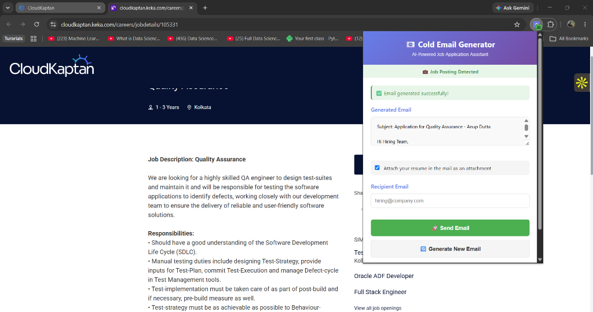
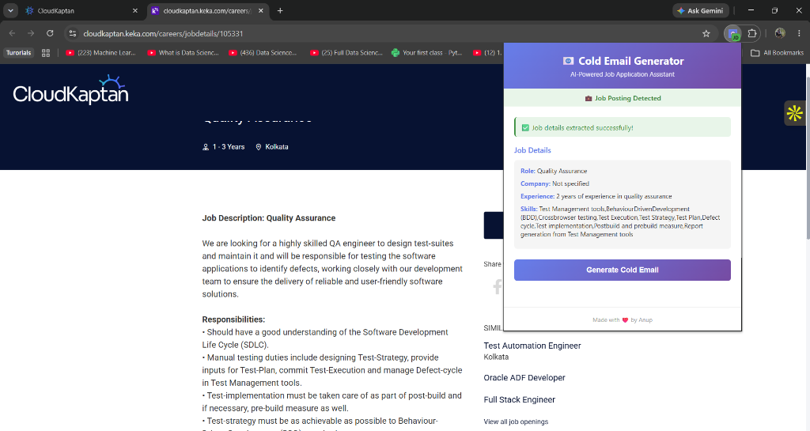
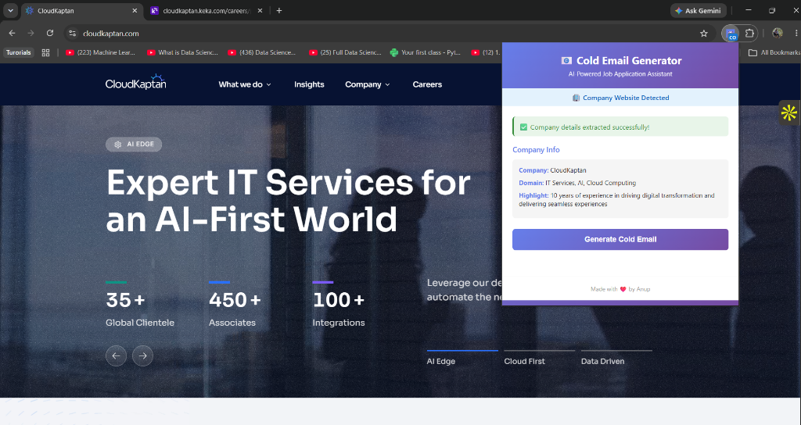
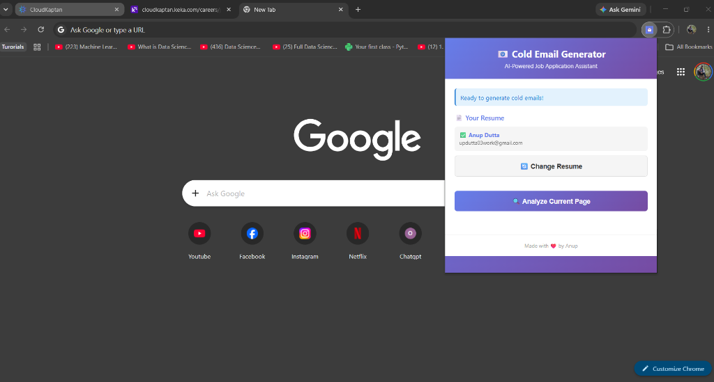
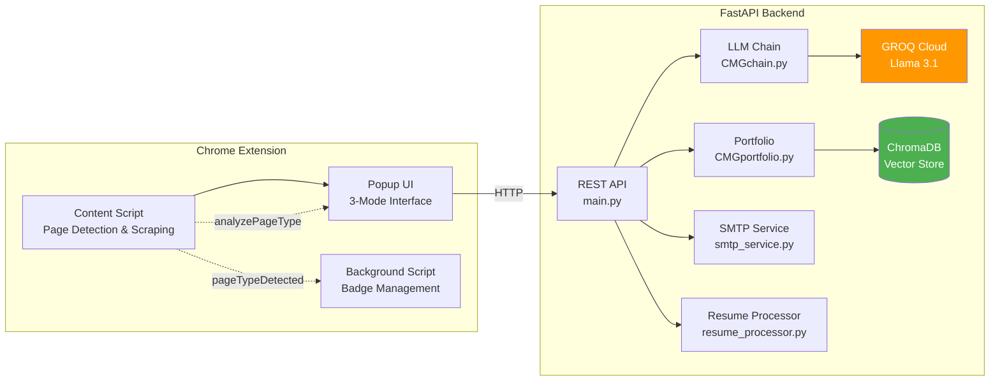
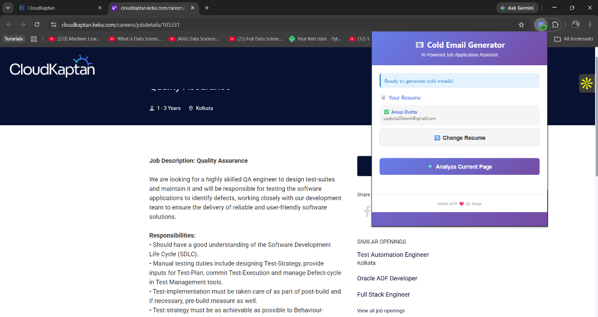
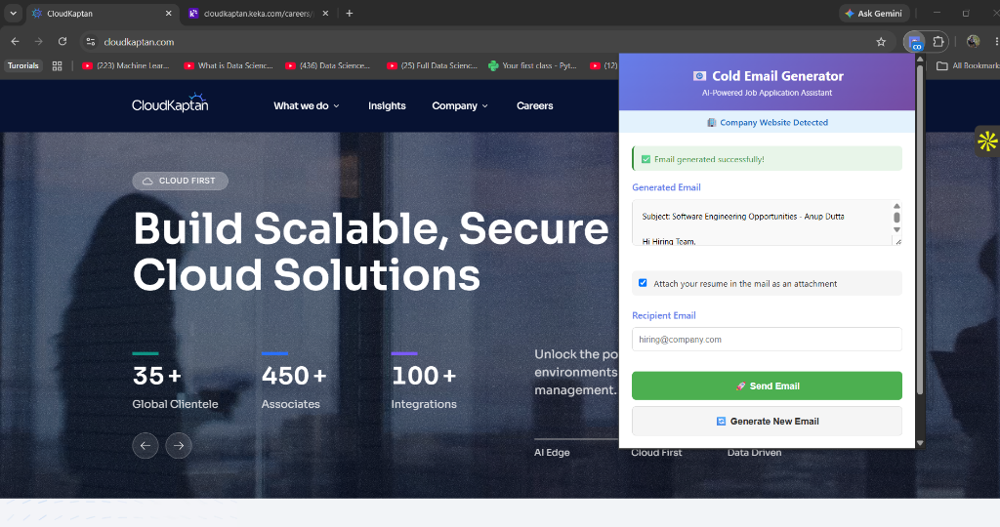

<p align="center">
  
</p>

<h1 align="center">📧 Cold Email Generator</h1>

<p align="center">
  <strong>An AI-powered Chrome extension that reads any webpage, understands the context, and writes a personalized cold email — ready to send from your Gmail in one click.</strong>
</p>

<p align="center">
  
  
  
  
  
</p>

---

## 🎯 What Is This?

**Cold Email Generator** turns any job search into a 30-second workflow:

1. **Browse** to a job posting, a company website, or literally any page
2. **Click** the extension — it instantly detects what kind of page you're on
3. **AI writes** a personalized cold email using your resume, matching your skills to the opportunity
4. **Edit** the email right in the popup if you want to tweak it
5. **Send** directly from your Gmail with your resume attached — all without leaving the page

No copy-pasting job descriptions. No opening Gmail in another tab. No formatting resumes as attachments manually. Just click, review, send.

---

## ✨ What Makes This Special

### 🧠 3-Mode Context Detection
The extension doesn't just work on job postings. It **understands what page you're on** and adapts automatically:

| Mode | When It Activates | What It Does |
|------|-------------------|--------------|
| 💼 **Job Posting** | LinkedIn Jobs, Indeed, career pages | Extracts role, skills, requirements → writes a targeted application email |
| 🏢 **Company Website** | Any company's homepage or about page | Extracts company name, domain, highlights → writes an exploratory outreach email |
| 📧 **Generic** | Any other page | Uses your resume alone → writes a general-purpose cold email |

#### 💼 Job Posting Mode
> Detects job postings on career pages, extracts role details, and generates a targeted application email.

<p align="center">
  
</p>

#### 🏢 Company Website Mode
> Detects company websites, extracts company info (name, domain, highlights), and generates an outreach email.

<p align="center">
  
</p>

#### 📧 Generic Mode
> On any other page (like Google), it generates a resume-based cold email without needing page context.

<p align="center">
  
</p>

### 📄 Resume-Powered Personalization
Upload your resume **once** — the AI extracts your name, skills, projects, education, and contact details. Every email it writes is **personalized to YOU**, not a generic template. Change your resume? Just re-upload and all future emails reflect the new profile.

### ✏️ Edit Before You Send
The generated email appears in an **editable text area** — not a read-only preview. Tweak a sentence, add a personal note, fix a name. It's your email; the AI just gives you a head start.

<p align="center">
  
</p>

### 📎 One-Click Resume Attachment
A checkbox lets you attach your resume PDF to the outgoing email. Uncheck it if you don't want to attach it. The resume is sent as a real email attachment — not a Google Drive link.

### ⚡ Zero-Cost Stack
Every service used is free: GROQ API (free tier), Gmail SMTP (500 emails/day), ChromaDB (local). **Total cost: $0.**

---

## 🏗️ Architecture



---

## 📸 How It Works — Step by Step

### Step 1: Open the Extension
Click the extension icon on any page. Your resume is already loaded.

<p align="center">
  
</p>

### Step 2: Analyze the Page
Click **"🔍 Analyze Current Page"** — the AI detects the page type and extracts relevant information.

<p align="center">
  
</p>

### Step 3: Generate & Send
Click **"Generate Cold Email"** → edit the email → check "Attach resume" → enter recipient → hit **Send**.

<p align="center">
  
</p>

### It works on company websites too!

<p align="center">
  
</p>

---

## 🚀 Setup Guide

### Prerequisites

| Requirement | Where to Get It |
|-------------|----------------|
| **Python 3.8+** | [python.org/downloads](https://www.python.org/downloads/) |
| **Google Chrome** | [google.com/chrome](https://www.google.com/chrome/) |
| **GROQ API Key** (free) | [console.groq.com](https://console.groq.com/) → create account → API Keys |
| **Gmail App Password** (free) | See [Step 2](#step-2--configure-environment) below |

---

### Step 1 — Clone & Install Dependencies

```bash
# Clone the repository
git clone https://github.com/Anup2003D/Cold-Email-Generator.git
cd "Cold Emaill Generator"

# Create and activate a virtual environment
python -m venv venv
venv\Scripts\activate          # Windows
# source venv/bin/activate     # macOS / Linux

# Install all dependencies
pip install -r requirements.txt
```

---

### Step 2 — Configure Environment

Create a file named `.env` in the **project root folder** with the following contents:

```env
# Required — Get yours free at https://console.groq.com/
GROQ_API_KEY=your_groq_api_key_here

# Required for sending emails
SMTP_EMAIL=your.email@gmail.com
SMTP_PASSWORD=xxxx xxxx xxxx xxxx
SMTP_SENDER_NAME=Your Full Name
SMTP_SERVER=smtp.gmail.com
SMTP_PORT=587
```

<details>
<summary><strong>📋 How to get a Gmail App Password (click to expand)</strong></summary>

<br>

1. Go to your Google Account → [myaccount.google.com](https://myaccount.google.com)
2. Navigate to **Security** → make sure **2-Step Verification** is turned ON
3. Go to [myaccount.google.com/apppasswords](https://myaccount.google.com/apppasswords)
4. Select **App: Mail** and **Device: Windows Computer** (or your OS)
5. Click **Generate** — you'll see a **16-character password** like `abcd efgh ijkl mnop`
6. Copy that password into your `.env` file as `SMTP_PASSWORD`

> ⚠️ **Important:** This is NOT your Gmail login password. It's a separate app-specific password. Keep it secret.

</details>

---

### Step 3 — Start the Backend Server

```bash
# Make sure your venv is activated
venv\Scripts\activate

# Start the FastAPI server
python main.py
```

You should see:

```
Starting Cold Email Generator API...
API Documentation: http://localhost:8000/docs
INFO:     Uvicorn running on http://localhost:8000
```

> 💡 **Tip:** Keep this terminal open while using the extension. The extension communicates with this local server.

---

### Step 4 — Load the Chrome Extension

1. Open Chrome and navigate to `chrome://extensions/`
2. Toggle **Developer mode** ON (top-right corner)
3. Click **Load unpacked**
4. Select the `extension/` folder inside the project
5. Pin the extension to your toolbar for easy access

---

### Step 5 — Upload Your Resume

1. Click the extension icon in your toolbar
2. Click **📤 Upload Resume (PDF)**
3. Select your resume PDF file
4. Enter your full name when prompted
5. You'll see a confirmation: ✅ Resume uploaded successfully!

Your resume is now parsed and every future email will be personalized with your skills, projects, and contact info.

<p align="center">
  
</p>

---

### Step 6 — Generate & Send Your First Email

1. Navigate to a **job posting** (e.g., LinkedIn Jobs, Indeed, or any career page)
2. Click the extension → click **🔍 Analyze Current Page**
3. Review the extracted job details
4. Click **Generate Cold Email**
5. Edit the email if needed
6. Enter the recipient's email address
7. Check/uncheck the **Attach resume** checkbox
8. Click **🚀 Send Email**

Done! 🎉 The email is sent from your Gmail with your resume attached.

---

## 📡 API Reference

The backend exposes these REST endpoints at `http://localhost:8000`:

| Method | Endpoint | Description |
|--------|----------|-------------|
| `POST` | `/api/extract-job` | Extract structured job data from scraped page text |
| `POST` | `/api/extract-company` | Extract company info from a company website |
| `POST` | `/api/generate-email` | Generate a personalized cold email (3 modes) |
| `POST` | `/api/send-email-smtp` | Send the email via Gmail SMTP with optional resume attachment |
| `GET` | `/api/smtp-status` | Check if SMTP is configured correctly |
| `POST` | `/api/upload-resume` | Upload a PDF resume and generate portfolio |
| `GET` | `/api/resume-status` | Check if a resume has been uploaded |
| `GET` | `/api/portfolio` | View the parsed portfolio data |
| `DELETE` | `/api/resume` | Delete current resume and reset portfolio |
| `GET` | `/health` | Server health check |

Interactive API docs: **[http://localhost:8000/docs](http://localhost:8000/docs)**

---

## 🗂️ Project Structure

```
Cold Email Generator/
├── main.py                          # FastAPI server entry point
├── requirements.txt                 # Python dependencies
├── .env                             # Your API keys and SMTP credentials
│
├── App/                             # AI/LLM logic
│   ├── CMGchain.py                  # LangChain prompts — 3 email templates + company extraction
│   ├── CMGportfolio.py              # ChromaDB vector search for portfolio matching
│   ├── CMGutils.py                  # Text cleaning utilities
│   └── Resource/
│       └── my_portfolio.csv         # Fallback portfolio (tech stack + project links)
│
├── backend/                         # Backend services
│   ├── smtp_service.py              # Gmail SMTP sender with PDF attachment support
│   ├── resume_processor.py          # PDF resume parser → structured portfolio JSON
│   ├── resumes/                     # Uploaded resume PDFs
│   └── applicant_portfolio.json     # Auto-generated portfolio from resume
│
├── extension/                       # Chrome Extension (Manifest V3)
│   ├── manifest.json                # Extension configuration
│   ├── popup.html                   # Extension popup UI (3-mode states)
│   ├── popup.js                     # UI logic, API calls, state management
│   ├── content.js                   # Page scraper + 3-mode page type detection
│   ├── background.js                # Service worker + badge management
│   └── icons/                       # Extension icons
│
└── assets/
    └── screenshots/                 # README images
```

---

## 🎨 Customization

### Email Templates
Edit the LLM prompts in [`App/CMGchain.py`](App/CMGchain.py) to change the email tone, structure, or template. There are 3 templates:
- `write_mail_job_posting()` — for job applications
- `write_mail_company_website()` — for company outreach
- `write_mail_generic()` — for general cold emails

### Portfolio (without resume upload)
If you prefer not to upload a resume, edit `App/Resource/my_portfolio.csv`:

```csv
"Techstack","Links"
"Python, Machine Learning","https://github.com/you/ml-project"
"React, TypeScript","https://github.com/you/react-app"
```

### Deploying to Production
Update `API_BASE_URL` in `extension/popup.js` (line 2) to your deployed server URL:

```javascript
const API_BASE_URL = 'https://your-api.onrender.com';
```

---

## 🔧 Troubleshooting

<details>
<summary><strong>Server won't start</strong></summary>

```bash
# Make sure venv is activated
venv\Scripts\activate
pip install -r requirements.txt

# Verify .env exists at project root with GROQ_API_KEY
python main.py
```
</details>

<details>
<summary><strong>SMTP emails not sending</strong></summary>

- Confirm **2-Step Verification** is ON for your Google account
- Verify the App Password in `.env` has no extra spaces
- Check SMTP status: visit `http://localhost:8000/api/smtp-status`
</details>

<details>
<summary><strong>Extension shows error / can't connect</strong></summary>

- Make sure the backend is running: visit [http://localhost:8000/health](http://localhost:8000/health)
- Right-click the extension popup → **Inspect** → check the Console tab for errors
- Try reloading the extension at `chrome://extensions/`
</details>

<details>
<summary><strong>"Module not found" errors</strong></summary>

```bash
# Always activate the venv before running
venv\Scripts\activate
python main.py
```
</details>

---

## 💰 Cost

| Service | Cost |
|---------|------|
| GROQ API (Llama 3.1) | **Free** |
| Gmail SMTP | **Free** (500 emails/day) |
| ChromaDB | **Free** (runs locally) |
| **Total** | **$0** |

---

## 🔒 Security & Privacy

- All credentials stay in your local `.env` file — nothing is committed to git
- SMTP App Passwords can only send email — they cannot read your inbox
- The extension only reads page content when **you click** the analyze button
- No user data is stored or sent to third parties (only GROQ receives the text for LLM inference)
- Resume data is stored locally in `backend/applicant_portfolio.json`

---

## 📋 Roadmap

- [ ] Application tracking dashboard
- [ ] Follow-up email scheduling
- [ ] Multiple email account support
- [ ] Company research integration
- [ ] Email template library (by role / seniority)

---

## 📄 License

MIT — free to fork, customize, and use for your own job search.

---

<p align="center">
  <strong>Made with ❤️ and ☕ by <a href="https://github.com/Anup2003D">Anup Dutta</a></strong>
</p>
